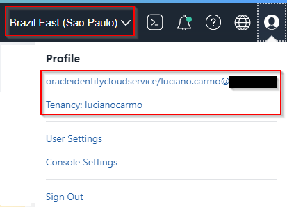
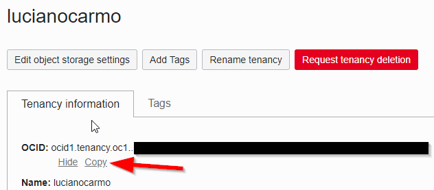
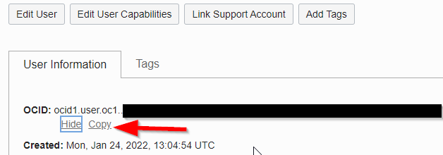
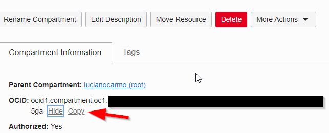
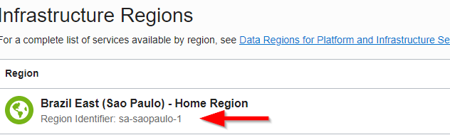
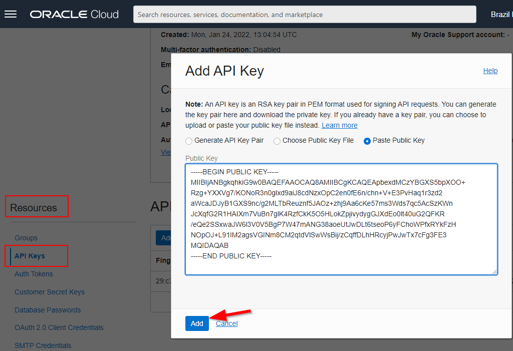

# Github Actions e Terraform com OCI
[](https://github.com/lucianosilva/oci-terraform-sample1)

Objetivo deste repositório é mostrar o provisionamento de recursos no OCI (Oracle Cloud Infrastructure), utilizando o Github Actions como pipeline e Terraform.

- [Terraform](#o-que-é-terraform-)
- [Pré-requisitos](#pré-requisitos)
- [Obtendo credenciais](#obtendo-credenciais)
- [Contato](#contato)

## O que é Terraform? 🗒
Terraform é uma ferramenta de software livre de "infraestrutura como código" criada pela HashiCorp.
Permite aos desenvolvedores usar uma linguagem de configuração de alto nível (programação declarativa) chamada HCL para descrever a infraestrutura na cloud para executar um aplicativo.

Através dos provedores do Terraform, ou seja, plugins que implementam tipos de recursos capazes de comunicar com o ambiente cloud do provedor. Sendo assim, o Terraform é capaz de implementar em ambientes de cloud híbrida ou multicloud.

## Pipeline
Github Actions ...

Lista de ferramentas para pipeline
https://www.lambdatest.com/blog/31-best-ci-cd-tools/

## Pré-requisitos

- [x] Criar uma conta no <a href="https://www.oracle.com/br/cloud/free/">Always Oracle Cloud Free</a>.
- [x] Se você estiver trabalhando no Windows, instale o `Git Bash`.
- [x] Instalar o `OCI CLI`.
- [x] Instalar o `Terraform`.

## Obtendo credenciais
Para se comunicar através OCI CLI com o OCI será necessário obter algumas informações da conta cloud, isto deverpa
Acesse sua conta no OCI (http://cloud.oracle.com), efetue o login e siga os passos abaixo. Você deverá obter as seguintes informações:

```
- Tenancy OCID
- Region
- Compartment OCID
- User OCID
- Fingerprint
- Username
- User Auth Token
```

- Canto superior direito clique no menu Profile, em seguida clique no Tenancy.



- Na página de informação do Tenancy, clique em Copy e salve o `Tenancy OCID`.



- Retorne ao menu Profile, e clique no nome de usuário. Na página de informação do usuário, clique em Copy e salve o `User OCID`.



- Agora no canto superior esquerdo, clique no hamburguer menu, vá em `Identity & Security > Identity > Compartments`. Selecione o compartment, clique em Copy e salve o `Compartment OCID`.



`Importante: O usuário deverá ter acesso como manage ao compartment selecionado`

- Clique no hamburguer menu, vá em Governance & Administration > Region Management, copie e salve o `Region`.




## Gerando Auth Token

Execute os comandos a seguir para gerar as chaves privada e pública. Se você estiver trabalhando no *Windows utilize o Git Bash*.

```
$ mkdir .oci
$ openssl genrsa -out .oci/oci_api_key.pem 2048
$ chmod go-rwx .oci/oci_api_key.pem
$ openssl rsa -pubout -in .oci/oci_api_key.pem -out .oci/oci_api_key_public.pem
$
$ ls -ltr .oci/
total 5
-rw-r--r-- 1 lcarmo 197121 1698 Jun  2 14:02 oci_api_key.pem
-rw-r--r-- 1 lcarmo 197121  460 Jun  2 14:04 oci_api_key_public.pem
```

<p>Agora copie o conteúdo da chave pública para a API Key do usuário.</p>

```
$ cat .oci/oci_api_key_public.pem
-----BEGIN PUBLIC KEY-----
MIIBIjANBgkqhkiG9w0BAQEFAAOCAQ8AMIIBCgKCAQEApbexdMCzYBGXS5bpXOO+
Rzg+YXXVg7/KONoR3n0glxd9aiJ8cdNzxOpC2en0fE6n/chn+V+E3PvHaq1r3zd2
aWcaJDJyB1GXS9nc/g2MLTbReuznf5JAOz+zhj9Aa6cKe57ms3Wds7qc5AcSzKWn
JcXqfG2R1HAIXm7VuBn7glK4RzfCkK5O5HLokZpjivydygGJXdEo0lt40uG2QFKR
/eQe2SSxwaJW6l3V0V5BgP7W47mANG38aoeUtJwDLt6tseoP6yFChoWPfxRYkFzH
NOpOJ+L91IM2agsVGINm8CM2qtdVlSwWsBij/zCqffDLhHRcyjPwJwTx7cFg3FE3
MQIDAQAB
-----END PUBLIC KEY-----
```

<p>Retorne ao console do OCI e vá para o menu `Identity & Security > Identity > Users`, clique no usuário e vá para o menu no canto inferior esquerdo `Resources > API Keys` e adicione a nova chave pública, conforme a imagem abaixo.</p>



Com isso feito, você terá acesso ao **Fingerprint** copie e salve este valor.
Ainda nessa mesma sessão, no canto inferior esquerdo clique no menu `Auth Tokens` e crie um novo Token, copie e salve o conteúdo para ser utilizado como `User Auth Token`.

## Configurando variáveis do Terraform

```
touch ~/.bash_profile

echo "export TF_VAR_user_ocid=ocid1.user.oc1..<HIDDEN>" >> ~/.bash_profile
echo "export TF_VAR_fingerprint=29:<HIDDEN>:2a" >> ~/.bash_profile
echo "export TF_VAR_region=sa-saopaulo-1" >> ~/.bash_profile
echo "export TF_VAR_tenancy_ocid=ocid1.tenancy.oc1..<HIDDEN>" >> ~/.bash_profile
echo "export TF_VAR_compartment_ocid=ocid1.compartment.oc1..<HIDDEN>" >> ~/.bash_profile
echo "export TF_VAR_private_key_path=~/.oci/oci_api_key.pem" >> ~/.bash_profile
echo "export TF_VAR_oci_username=oracleidentitycloudservice/username@X.com" >> ~/.bash_profile
echo "export TF_VAR_oci_user_authtoken=<HIDDEN>" >> ~/.bash_profile

. ~/.bash_profile
```

## Play no Terraform


### Contato

[](https://twitter.com/lucianosilva)
[](https://www.linkedin.com/in/lucianocarmo/)

<p align="center">Copyright © 2022 <a href="https://github.com/lucianosilva">lucianocarmo</a></p>